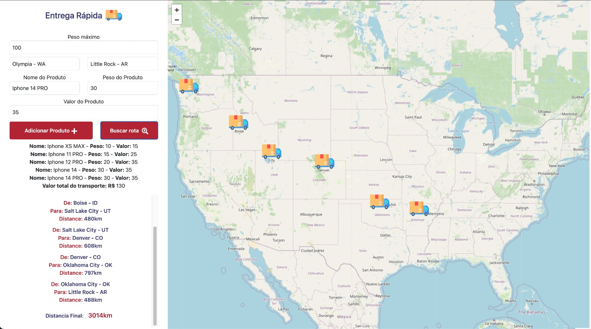
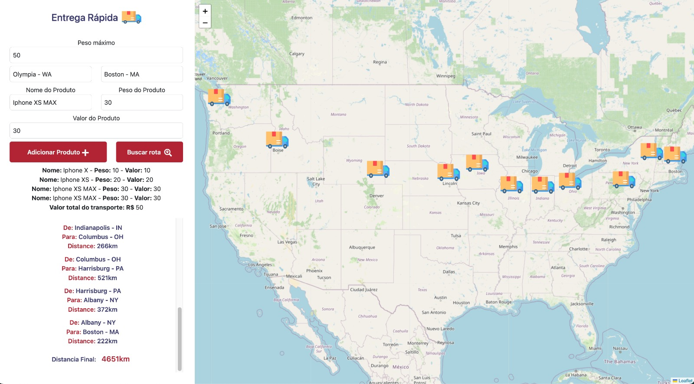
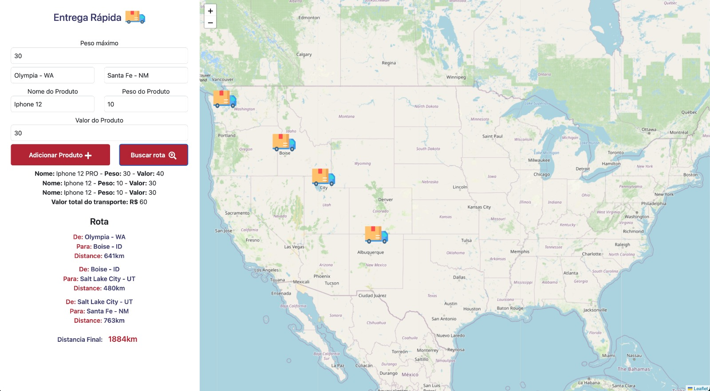

# Final - Entrega Rápida

**Número da Lista**: 4<br>
**Conteúdo da Disciplina**: Grafos 2 + Programação Dinâmica<br>

## Alunos
|Matrícula | Aluno |
| -- | -- |
| 18/0028685  |  Victor Samuel dos Santos Lucas |
| 17/0115500  |  Vinícius Vieira de Souza |

## Sobre 
Este projeto tem como objetivo a servir como base para a implementação de algoritmos referentes aos conteúdos de: Grafos 2 e Programação Dinâmica.

No contexto do projeto se deseja realizar uma entrega rápida(que acontece percorrendo o menor caminho) de uma transportadora que deseja carregar a maior quantidade possível de itens valiosos.

Para a implementação de Grafos 2 no projeto foi utilizado o algoritmo de Dijkstra a fim de realizar a busca pelo menor caminho entre dois pontos em uma grafo. Que no caso é formado por pontos de parada nos estados Unidos.

Já o algoritmo de Programação Dinâmica utilizado é responsável por calcular o valor máximo dos preços de produtos a serem transportados.

## Screenshots

### Busca de rota com transporte máximo de 100 para carga:


### Busca de rota com transporte máximo de 50 para carga:


### Busca de rota com transporte máximo de 30 para carga:



## Instalação 
**Linguagem**: Javascript (Frontend/Backend)<br>
**Framework**: Node.js (Backend) / React (Frontend)<br>

## Requisitos:
- Node: Versão 16+
- Npm: Versão 6+

## Uso 
### Passo 1: 
Entre no diretorio do /backend e execute o seguinte comando
```terminal
npm install 
```

### Passo 2:
Ainda no diretorio do backend, coloque o servidor pra rodar com o comando:
```terminal
node src/server.js ou nodemon src/server.js
```

### Passo 4:
Ainda no deretorio do /frontend coloque o front para rodar com o comando:
```terminal
npm start
```

### Passo 5:
Caso não abra automáticamente, para acessar a aplicação abra seu navegador no seguinte endereço: http://localhost:3000

## OBS:
- O backend e frontend fazem uso respectivamente das portas: http://localhost:8080 e http://localhost:3000, dessa forma certifique-se de que estejam livres para rodar a aplicação.

## Vídeo de Apresentação
Quaisquer outras informações sobre seu projeto podem ser descritas abaixo.


